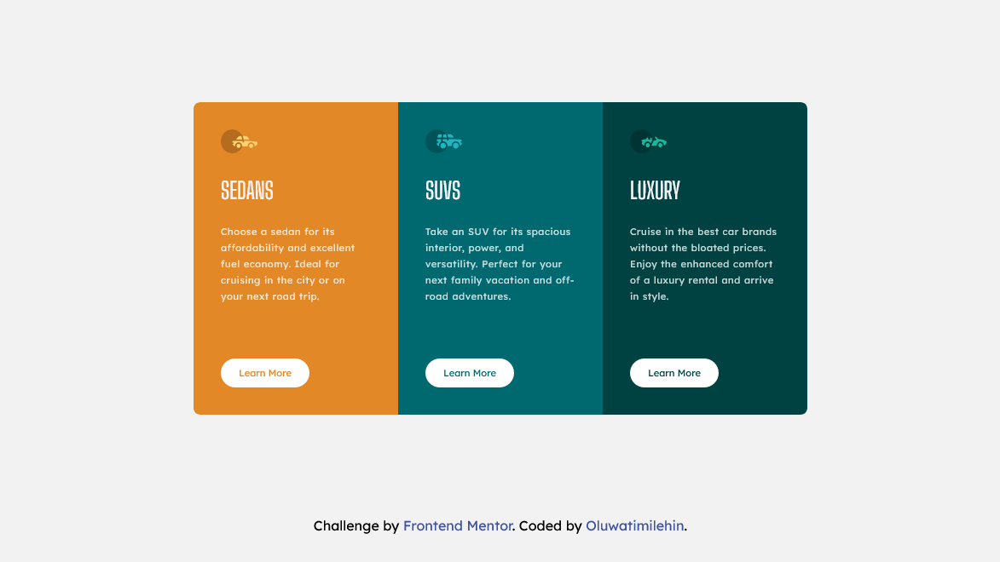
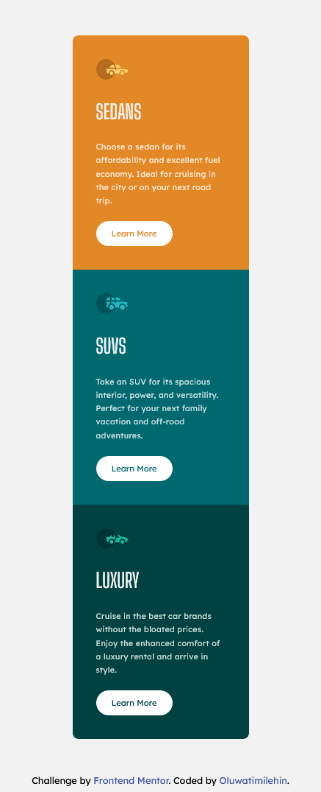

# Frontend Mentor - 3-column preview card component solution

This is a solution to the [3-column preview card component challenge on Frontend Mentor](https://www.frontendmentor.io/challenges/3column-preview-card-component-pH92eAR2-). Frontend Mentor challenges help you improve your coding skills by building realistic projects.

## Table of contents

- [The challenge](#the-challenge)
- [Screenshot](#screenshot)
- [Links](#links)
- [My process](#my-process)
  - [Built with](#built-with)
  - [What I learned](#what-i-learned)
  - [Useful resources](#useful-resources)
- [Author](#author)

### The challenge

Users should be able to:

- View the optimal layout depending on their device's screen size
- See hover states for interactive elements

### Screenshot




### Links

- Solution URL: [Frontend Mentor](https://www.frontendmentor.io/solutions/3column-preview-card-component-PZxKLAsX1)
- Live Site URL: [Netlify](https://coder-teamie-three-column-card.netlify.app/)

## My process

I started this project by structuring my HTML first, determining what the content of the project would be and how many containers and sub-containers I would require.
Then I moved on to creating a list of some "global variables" which I resused in the entire project after which I designed the mobile layout first then moved to the desktop layout using SCSS for my whole styling and making use of modules which allowed me break up my code into lego blocks.

### Built with

- Semantic HTML5 markup
- CSS custom properties
- Flexbox
- CSS Grid
- SASS
- Mobile-first workflows

Some code snippets:

```html
<article class="card card-2">
  
  <h2>SUVs</h2>
  <p>
    Take an SUV for its spacious interior, power, and versatility. Perfect for
    your next family vacation and off-road adventures.
  </p>
  <a href="#" class="btn">learn more</a>
</article>
```

```scss
@mixin display($layout, $direction) {
  display: $layout;
  flex-direction: $direction;
}

@mixin desktop {
  @media screen and (min-width: $desktopLayout) {
    @content;
  }
}
```

## Author

- Instagram - [Oluwatimilehin](https://www.instagram.com/_teamie_/)
- Frontend Mentor - [@coder-teamie](https://www.frontendmentor.io/profile/coder-teamie)
- Twitter - [@teamie\_\_](https://twitter.com/teamie__)
